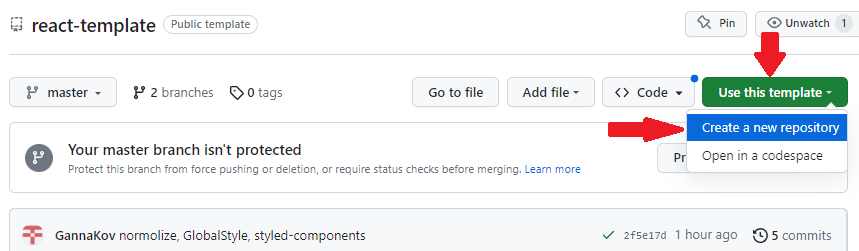
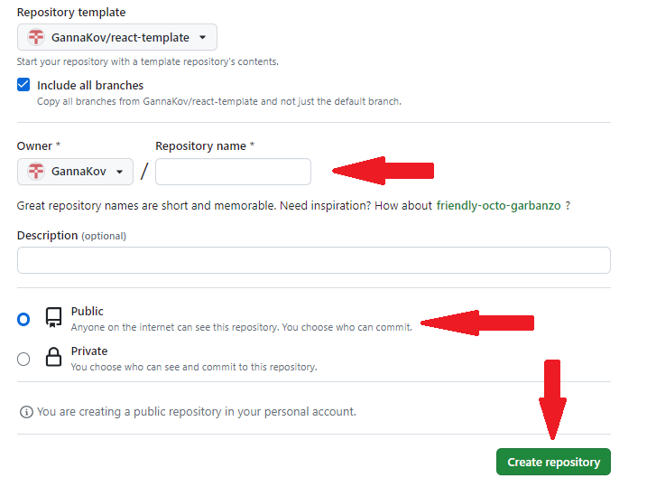
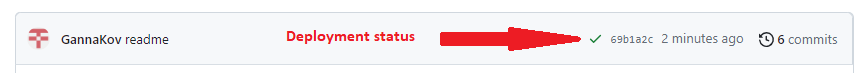

# React + Vite

This template provides a minimal setup to get React working in Vite with HMR and some ESLint rules.

Currently, two official plugins are available:

- [@vitejs/plugin-react](https://github.com/vitejs/vite-plugin-react/blob/main/packages/plugin-react/README.md) uses [Babel](https://babeljs.io/) for Fast Refresh
- [@vitejs/plugin-react-swc](https://github.com/vitejs/vite-plugin-react-swc) uses [SWC](https://swc.rs/) for Fast Refresh

## Creating a repository by template

Use this repository as a template for creating a repository
of your project. To use it just tap the `«Use this template»` button and choose
`«Create a new repository»` option, as you can see on the image below.



The page for creating a new repository will open on the next step. Fill out
the Name field and make sure the repository is public, then click
`«Create repository from template»` button.



You now have a personal project repository, having a repository-template file
and folder structure. After that, you can work with it as you would with any
other private repository:

- clone it on your computer using the command `git clone <repository URL>`.
- set up a remote repository named 'origin' with the command
  `git remote add origin <repository URL>`
- write code
- commit
- send it to GitHub (first time use `git push -u origin main`)

## Preparing for coding

1. Make sure you have an LTS version of Node.js installed on your computer.
   [Download and install](https://nodejs.org/en/) if needed.
2. Install the project's base dependencies with the `npm install` command.
3. Start development mode by running the `npm run dev` command.
4. Go to [http://localhost:5173](http://localhost:5173) in your browser. This
   page will automatically reload after saving changes to the project files.
5. In vite.config.js change base: "/template-vite-react/" to
   `base: "/your_repo_name/"`

6. Do not forget to change <title> in index.html

## Deploy

Go to your GitHub Pages configuration (`Settings` >`Pages`) in the repository settings page and choose the source of deployment as `GitHub Actions`, this will lead you to create a workflow that builds and deploys your project (choose `create your own`), a sample workflow that installs dependencies and builds using npm is provided:

```yaml
# Simple workflow for deploying static content to GitHub Pages
name: Deploy static content to Pages

on:
  # Runs on pushes targeting the default branch
  push:
    branches: ["main"]

  # Allows you to run this workflow manually from the Actions tab
  workflow_dispatch:

# Sets the GITHUB_TOKEN permissions to allow deployment to GitHub Pages
permissions:
  contents: read
  pages: write
  id-token: write

# Allow one concurrent deployment
concurrency:
  group: "pages"
  cancel-in-progress: true

jobs:
  # Single deploy job since we're just deploying
  deploy:
    environment:
      name: github-pages
      url: ${{ steps.deployment.outputs.page_url }}
    runs-on: ubuntu-latest
    steps:
      - name: Checkout
        uses: actions/checkout@v4
      - name: Set up Node
        uses: actions/setup-node@v3
        with:
          node-version: 18
          cache: "npm"
      - name: Install dependencies
        run: npm install
      - name: Build
        run: npm run build
      - name: Setup Pages
        uses: actions/configure-pages@v3
      - name: Upload artifact
        uses: actions/upload-pages-artifact@v2
        with:
          # Upload dist repository
          path: "./dist"
      - name: Deploy to GitHub Pages
        id: deployment
        uses: actions/deploy-pages@v2
```

Save it as `workflow.yml`.

Do not forget to `git pull` to fetch the changes into your local repository.

### Deployment status

The deployment status of the latest commit is displayed with an icon next to its
ID.

- **Yellow color** - the project is being built and deployed.
- **Green color** - deployment completed successfully.
- **Red color** - an error occurred during linting, build or deployment.

More detailed information about the status can be viewed by clicking on the
icon, and in the drop-down window, follow the link `Details`.



### Live page

After some time, usually a couple of minutes, the live page can be viewed at the
address specified in the edited `homepage` property.

### Routing

If your application uses the `react-router-dom` library for routing, you must
additionally configure the `<BrowserRouter>` component by passing the exact name
of your repository in the `basename` prop. Slashes at the beginning and end of
the line are required.

```jsx
<BrowserRouter basename="/your_repo_name/">
  <App />
</BrowserRouter>
```

## How it works


1. After each push to the `main` branch of the GitHub repository, a special
   script (GitHub Action) is launched from the `.github/workflows/workflow.yml`
   file.
2. All repository files are copied to the server, where the project is
   initialized and linted and built before deployment.

### Useful links

- [react-icons](https://react-icons.github.io/react-icons/)
- [styled-components](https://styled-components.com/)
- [modern-normalize](https://github.com/sindresorhus/modern-normalize)
- [mui](https://mui.com/)
- [tailwind](https://tailwindcss.com/)
- [uuid](https://www.npmjs.com/package/uuid)
- [randomUUID](https://developer.mozilla.org/en-US/docs/Web/API/Crypto/randomUUID)
- [axios](https://axios-http.com/docs/intro)
